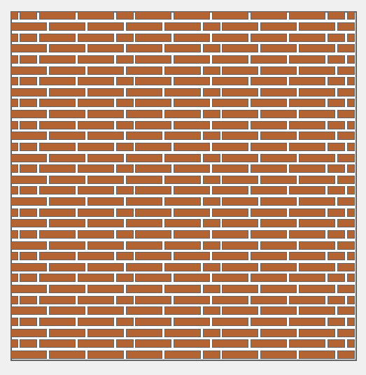

# Bricklaying Robot Simulation

A configurable bricklaying 2D robot simulation system with interactive visualization, supporting multiple bond patterns and build algorithms.

## Quick Setup

### Prerequisites
- Python 3.12+ 
- uv (recommended) or pip package manager

### Installation

**Option 1: Using uv (recommended)**
```bash
# Install uv (visit https://docs.astral.sh/uv/getting-started/installation/ for OS specific install)
curl -LsSf https://astral.sh/uv/install.sh | sh

# Clone the repository
git clone https://github.com/TheBlackCerberus/bricklaying_robot.git
cd bricklaying_robot

# Create virtual environment and install dependencies
uv sync

# Activate virtual environment
source .venv/bin/activate
```

**Option 2: Using pip**
```bash
# Clone the repository
git clone https://github.com/TheBlackCerberus/bricklaying_robot.git
cd bricklaying_robot

# Install dependencies
pip install -r requirements. txt
```

## Usage

### Basic Commands

**Run with default settings:**
```bash
# runs default: naive_build + stretcher_bond_wall
python -m src.main
```

**Specify wall configuration:**
```bash
python -m src.main --wall stretcher_bond_wall
python -m src.main --wall english_cross_bond_wall
python -m src.main --wall flemish_bond_wall
python -m src.main --wall wild_bond_wall
```

**Adjust visualization scale:**
```bash
python -m src.main --scale 0.8  # Larger view
python -m src.main --scale 0.2  # Smaller view
```

**Start in debug mode:**
```bash
python -m src.main --debug
```

**Complete example:**
```bash
python -m src.main --wall english_cross_bond_wall --scale 0.4 --debug
```

### Interactive Controls

#### Building Modes
- **Manual Mode** (default): Build brick by brick manually
- **Robot Mode**: Follow optimized robot algorithm with stride visualization

#### Manual Mode Controls
- `ENTER` - Build next brick
- `SPACE` - Build all remaining bricks instantly

#### Robot Mode Controls  
- `ENTER` - Build next brick in current stride
- `S` - Complete current stride and move robot to next position
- `A` - Auto-play mode (continuous building)

#### Common Controls
- `M` - Toggle between Manual/Robot modes
- `R` - Reset all bricks to planned state
- `D` - Toggle debug mode (shows grid and brick IDs)
- `ESC` - Exit application

### Wall Configurations

Supports these bond patterns:

1. **Stretcher Bond** (`stretcher_bond_wall`)
   - Simple running bond pattern
   - Each course offset by half brick length


2. **English Cross Bond** (`english_cross_bond_wall`) 
   - Alternating courses of full bricks and half-brick patterns
   - Even courses: All full bricks
   - Odd courses: Half, Quarter, Half, Half, ..., Half, Quarter, Half


3. **Flemish Bond** (`flemish_bond_wall`)
   - Alternating full and half bricks within each course
   - Even courses: Full, Half, full .. Half, Full
   - Odd courses: Half, Quarter, Full, Half, ..., Half, Quarter, Half


4. **Wild Bond** (`wild_bond_wall`)
   - Random mix of full and half bricks
   - 1/4 brick offset on alternate courses to prevent vertical joint alignment
   - Maximum 6 consecutive "staggered steps"
   - No two joints directly above each other




### Algo Approaches: 

1. **Naive Build Algorithm**
   - Zig - Zag movement for efficiency (moves kinda like mover)


### Configuration Files

Wall configurations are stored in `src/configs/`:
- `stretcher_bond_wall.yaml`
- `english_cross_bond_wall.yaml` 
- `flemish_bond_wall.yaml`


### Adding New Bond Patterns
1. Create bond calculator in `src/bonds/`
2. Add configuration file in `src/configs/`  
3. Register in `main.py` bond_calculators dict

### Adding New Algorithms
1. Create algorithm in `src/algos/`
2. Register in `main.py` algorithms dict
3. Follow signature: `(wall, robot, stride_manager, config) -> (strides, movements)`

